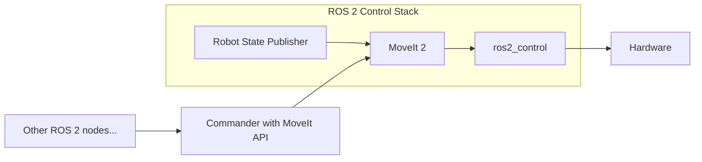

# MoveIt

参考：
- [MoveIt 官方网站](https://moveit.ros.org/)
- [MoveIt 文档](https://moveit.picknik.ai/main/index.html)
- [FishROS 机械臂运动规划](https://fishros.org.cn/forum/category/28/机械臂运动规划)
- [ROS 2 Moveit 2 - Control a Robotic Arm](https://www.udemy.com/course/ros2-moveit2/?couponCode=MT251006G3)

## What is MoveIt?

MoveIt 2 is the robotic manipulation platform for ROS 2 and incorporates the latest advances in motion planning, manipulation, 3D perception, kinematics, control, and navigation.

## Install MoveIt

两种方式：1. 二进制安装 2. 源码编译安装

- 二进制安装
  ```bash
  sudo apt install ros-humble-moveit
  ```
- 源码编译安装
  拉取源码
  ```bash
  git clone https://github.com/ros-planning/moveit2_tutorials -b humble --depth 1 moveit2/src/moveit2_tutorials
  ```
	将工作空间source到环境中
	```bash
	nano ~/.bashrc
	# source ~/moveit2/install/setup.bash
	```
  安装vcstool，自动读取repo文件并克隆其中的代码
  ```bash
  sudo apt install python3-vcstool
  cd moveit2/src
  vcs import < moveit2_tutorials/moveit2_tutorials.repos # 报错就把 repo 中地址加上镜像
  ```
  安装依赖，使用rosdepc
  ```bash
  wget http://fishros.com/install -O fishros && . fishros # 选3安装rosdepc
  rosdepc update
  cd moveit2
  rosdepc install --from-paths src --ignore-src -y
  ```
  编译
  ```bash
  cd moveit2
  colcon build --cmake-args -DCMAKE_BUILD_TYPE=Release
  ```
  编译中出错，发现是conda 的 Python 环境覆盖了系统默认 Python，解决方法：让 colcon 使用系统 Python
  ```bash
  which python3 # 查看系统python路径，/home/bernard/miniconda3/bin/python3，发现问题
  export PYTHONPATH=/opt/ros/humble/lib/python3.10/site-packages:$PYTHONPATH
  export PATH=/usr/bin:$PATH # 添加到.bashrc
  ```
  编译报错找不到 moveit_msgs
	```bash
	sudo apt update && sudo apt install -y ros-humble-moveit-msgs
	```
	编译 moveit_core 因内存不足被系统杀进程，cc1plus 报 Killed 错误
	```bash
  MAKEFLAGS="-j1" colcon build --executor sequential --cmake-args -DCMAKE_BUILD_TYPE=Release # 使用单核编译，一次只编译一个包，总编译时长约1小时30分钟，填 -j2 能缩短时间至10分钟左右
	```
	编译 moveit_task_constructor_core 时 Git 子模块拉取失败
	```bash
  cd ~/moveit2/src/moveit_task_constructor/
  rm -rf core/python/pybind11/ core/src/scope_guard/
  nano .gitmodules # 编辑.gitmodules，添加镜像
  git submodule update --init --recursive # 重新拉取子模块
	```
	编译完成后测试
	```bash
	ros2 launch moveit2_tutorials demo.launch.py
	```

### Update moveit2

从源码安装的好处就是可以及时更新，那么如何通过git更新？

```bash
cd ~/moveit2_ws/src
vcs pull
```

## Create robot model

```bash
mkdir moveit2_ws/src && cd moveit2_ws
colcon build
ros2 pkg create my_robot_description
cd my_robot_description
rm -rf include/ src/
mkdir urdf launch rviz
```

在包内 CMakeLists.txt 中添加：
```cmake
install(
  DIRECTORY launch rviz urdf
  DESTINATION share/${PROJECT_NAME}
)
```

目的是将这些文件安装到安装目录下，方便其他包查找使用

编译

```bash
cd ~/moveit2_ws
colcon build --packages-select my_robot_description
```

创建 urdf/arm.urdf 文件，编写机器人模型

- [ROS Wiki urdf/XML/link](https://wiki.ros.org/urdf/XML/link)
- [ROS Wiki urdf/XML/joint](https://wiki.ros.org/urdf/XML/joint)

安装 ros-humble-urdf-tutorials 包，方便可视化 urdf 模型

```bash
sudo apt install ros-humble-urdf-tutorials
ros2 launch urdf_tutorial display.launch.py model:=/home/bernard/moveit2_ws/src/my_robot_description/urdf/arm.urdf 
```

重点：

- link 的 origin 位置应填写几何中心位置
- joint 的 origin 位置应填写连接点相对于上一 joint 的位置
- 在开头放置 material 定义，后续 link 中可直接引用
  ```xml
  <material name="blue">
      <color rgba="0 0 0.5 1.0" />
  </material>
  <!-- 引用 -->
  <material name="blue"/>
  ```
- 打印TF树
  ```bash
  ros2 run tf2_tools view_frames # 需在rviz运行时执行
  ```

编程习惯：
- 不要一次性编写完整个机器人模型，每添加一个 link 和 joint 就在 rviz 中查看效果，避免出错后不知从何处排查
- 在编写 links & joints 时，可先指定 origin 和 axis 为默认值，编写完成后在 rviz 中查看模型，进行调整

使用 xacro 可以让 urdf 文件更简洁易读，便于维护

- [ROS Wiki xacro](https://wiki.ros.org/xacro)

一个标准的 xacro 文件结构：
```xml
<?xml version="1.0"?>
<robot xmlns:xacro="http://www.ros.org/wiki/xacro">
<!-- name 属性只需要在主文件中定义 -->
</robot>
```

在 urdf/ 目录下创建如下文件
```bash
urdf/
  my_robot.urdf.xacro # 主文件，需 include 其他 xacro 文件
  common_properties.xacro # 定义常用属性， material 等
  arm.xacro # 包含 links & joints 定义，引用 common_properties.xacro 中的属性
```

现在便可调用`my_robot.urdf.xacro`进行可视化

## Write launch file for rviz

上文使用 ros-humble-urdf-tutorials 包中的 display.launch.py 可视化 urdf 模型，那么如何自己编写 launch 文件

- [ROS Wiki roslaunch](https://wiki.ros.org/roslaunch)


使用rqt_graph查看节点关系，可以发现，想要实现使用 display.launch.py 一样的效果，需要启动以下节点：
- robot_state_publisher：订阅`/joint_states`话题，发布`/robot_description`话题
- joint_state_publisher：订阅`/robot_description`话题，发布`/joint_states`话题
- rviz2：订阅`/robot_description`话题

使用 xml 格式编写 launch 文件，display.launch.xml：
> xml 格式的 launch 文件远比 python 格式的 launch 文件更简洁，即使需要使用python 格式的 launch 文件，也可以在 xml 中调用

```xml
<?xml version="1.0" encoding="UTF-8"?>
<launch>
	<let name="urdf_path" value="$(find-pkg-share my_robot_description)/urdf/my_robot.urdf.xacro"/>
	
	<node pkg="robot_state_publisher" exec="robot_state_publisher">
		<param name="robot_description" value="$(command 'xacro $(var urdf_path)')"/>
	</node>

	<node pkg="joint_state_publisher_gui" exec="joint_state_publisher_gui"/>

	<node pkg="rviz2" exec="rviz2" output="screen"/>
</launch>
```

编译后启动
```bash
ros2 launch my_robot_description display.launch.xml
```

1. 点击右下角 Add 添加 RobotModel，填写 Description Topic 为 `/robot_description`
2. 修改 fixed frame 为 base_link
3. 点击右下角 Add 添加 TF 

可以看到机器人模型可以正常显示了，保存当前 rviz 配置，命名为`urdf_config.rviz`，放在`rviz/`目录下，之后 launch 文件就可以直接加载这个配置了
```xml
<let name="rviz_config_path" value="$(find-pkg-share my_robot_description)/rviz/urdf_config.rviz"/>
<node pkg="rviz2" exec="rviz2" output="screen" args="-d $(var rviz_config_path)"/>
```

## Control model with MoveIt

### Add collision tag

在 MoveIt 中，运动规划时会考虑碰撞检测，因此需要为机器人模型添加碰撞体

visual 元素用于可视化，collision 元素用于碰撞检测（碰撞体），两者都要包含geometry 和 origin 元素，其中 visaul 和 collision 的 geometry 可以相同，也可以不同，一般要求 collision 的几何体比 visual 的几何体更简单，简化计算，例如：
```xml

    <link name="shoulder_link">
	    <visual>
			<geometry>
				<cylinder length="0.5" radius="0.1"/>
			</geometry>
			<origin xyz="0 0 0.25" rpy="0 0 0"/>
			<material name="blue"/>
		</visual>
		<collision>
			<geometry>
        <!-- 碰撞体使用简单的 box -->
				<box size="0.2 0.2 0.5"/>
			</geometry>
			<origin xyz="0 0 0.25" rpy="0 0 0"/>
		</collision>
	</link>
```

### MoveIt Configuration

Create `my_robot_moveit_config` manually, or use the MoveIt Setup Assistant to automatically generate it given a robot description file (URDF or xacro).

- [手动配置](https://moveit.picknik.ai/main/doc/how_to_guides/moveit_configuration/moveit_configuration_tutorial.html)
- [使用Assistant配置](https://www.bilibili.com/video/BV1rdxdzkES5?p=19)

启动 MoveIt Setup Assistant，创建 MoveIt 配置包
```bash
ros2 launch moveit_setup_assistant setup_assistant.launch.py
```

文件结构：
```bash
my_robot_moveit_config/
  config/
    my_robot.ros2_control.xacro # ros2_control 配置文件，定义控制器类型、硬件接口等
    my_robot.srdf # 机器人语义描述文件，定义运动规划相关信息，如规划组、虚拟关节等，可以直接修改生成的 srdf 文件，无需再次运行 setup_assistant
    my_robot.xacro # include my_robot.ros2_control.xacro 和 my_robot.urdf.xacro 的路径
    ···
  launch/
    demo.launch.py # 启动 MoveIt 的 launch 文件，加载配置文件，启动相关节点
    move_group.launch.py # 启动 move_group 节点，提供运动规划服务
    ···

  package.xml
  CMakeLists.txt
  .setup_assistant
```

编译后运行
```bash
ros2 launch my_robot_moveit_config demo.launch.py
# 报错
[move_group-3]   what():  parameter 'robot_description_planning.joint_limits.joint1.max_velocity' has invalid type: expected [double] got [integer]
```

这是因为在`joint_limits.yaml`的`max_velocity`定义为整数，而 MoveIt 期望它是一个 double 类型的值，解决方法是将`joint_limits.yaml`的`max_velocity`定义修改为 double 类型，借此机会，修改`joint_limits.yaml`添加加速度限制：
```yaml
  # joint1:
  # ...
  joint6:
    has_velocity_limits: true
    max_velocity: 1.0
    has_acceleration_limits: true
    max_acceleration: 1.0
```

重新编译后运行，发现动作无法正常执行，原因是控制器命名空间出错，解决方法是在`moveit_controllers.yaml`中添加：
```yaml
  arm_controller:
    type: FollowJointTrajectory
    joints:
      - joint1
      - joint2
      - joint3
      - joint4
      - joint5
      - joint6
    action_ns: follow_joint_trajectory # 新增语句
    default: true # 新增语句
```

重新编译后运行，发现可以正常运动了

### Cartesian path planning

在正常运动规划中，MoveIt 会先进行逆运动学求解，得到一个可行的关节空间路径，然后再进行轨迹优化，得到一个平滑的关节空间轨迹，最后执行该轨迹，但是我们有时会要求末端执行器沿着线性路径运动

勾选`use cartesian Path`，重新规划，可以看到末端执行器沿着线性路径运动了，使用笛卡尔路径规划会导致可达空间变小，在某些情况下可能无法找到可行的路径

### Add gripper

重点：
- gripper 的其中一个 joint 需要添加 mimic 标签，表示它的运动模仿另一个 joint 的运动，例如：
  ```xml
      <joint name="gripper_left_finger_joint" type="prismatic">
          <parent link="gripper_base_link"/>
          <child link="gripper_left_finger_link"/>
          <origin xyz="-0.07 0 0.02" rpy="0 0 0"/>
          <axis xyz="1 0 0"/>
          <limit effort="1000.0" velocity="1.0" lower="0.0" upper="0.06"/>
      </joint>

      <joint name="gripper_right_finger_joint" type="prismatic">
          <parent link="gripper_base_link"/>
          <child link="gripper_right_finger_link"/>
          <origin xyz="0.07 0 0.02" rpy="0 0 0"/>
          <axis xyz="1 0 0"/>
          <!-- 模仿 gripper_left_finger_joint 的运动，乘以 -1.0，表示它的运动方向相反 -->
          <mimic joint="gripper_left_finger_joint" multiplier="-1.0"/>
          <limit effort="1000.0" velocity="1.0" lower="-0.06" upper="0.0"/>
      </joint>
  ```
  在实际应用中，gripper 的两个 finger 可能是通过一个电机驱动的，因此在程序中只需要控制一个变量，简化控制逻辑
- 将夹爪添加至现有框架：
  1. 将`gripper.xacro` include 到`my_robot.urdf.xacro`中，移动`material`标签至`common_properities.xacro`中，并在`my_robot.urdf.xacro`中定义一个fixed joint 将 gripper 连接到`arm.xacro`中定义的空link: `tool_link`上
  2. 使用 MoveIt Setup Assistant 更新设置
    - Regenerate Collision Matrix
    - Add a planning group for the gripper, choose no kinematic slover, and add gripper joints to the group
    - Create a few poses: gripper_open, gripper_closed, gripper_half_closed
    - Add an end effector(末端执行器)
    - Add ros2_control state interface for gripper_left_finger_joint
    - Add a ROS 2 and Moveit controller for the gripper (follow joint
trajectory)

## Write launch file for MoveIt

编写自己的launch文件用于启动 MoveIt，创建功能包`my_robot_bringup`
```bash
cd ~/moveit2_ws/src
ros2 pkg create my_robot_bringup
cd my_robot_bringup
rm -rf include/ src/
mkdir launch config
```

在包内 CMakeLists.txt 中删除 build 部分，添加 install 部分：
```cmake
install(
  DIRECTORY launch config
  DESTINATION share/${PROJECT_NAME}
)
```

- 将 MoveIt 配置包中的 ros2_controllers.yaml 移动至`my_robot_bringup/config/`目录下
- 将 MoveIt 配置包中的`my_robot.ros2_control.xacro`移动至`my_robot_description/urdf/`目录下，在`my_robot.urdf.xacro`中 include 该文件，在`my_robot.ros2_control.xacro`中移除所有的`xacro`标签，将剩余的引用变量替换为实际数值：`${name}`替换为`Arm`，`${initial_positions['joint1']}` 替换为`initial_positions.yaml`中定义的值，以此类推

这样做将机器人控制配置移出 MoveIt 配置包，避免被修改，同时也方便移植

下面先按顺序启动各个节点，了解总体流程，再编写最终的 launch 文件：

1. 启动 robot_state_publisher 节点，发布机器人状态信息
   ```bash
   ros2 run robot_state_publisher robot_state_publisher --ros-args -p robot_description:="$(xacro /home/bernard/moveit2_ws/src/my_robot_description/urdf/my_robot.urdf.xacro)"
   ````
2. 启动 ros2_control_node 节点，加载控制器配置文件
   ```bash
   ros2 run controller_manager ros2_control_node --ros-args --params-file ~/moveit2_ws/src/my_robot_bringup/config/ros2_controllers.yaml
   ```
   发现终端没有显示 "Loading hardware"，可能是因为 controller_manager 在寻找私有命名空间下的参数或话题，而 robot_state_publisher 发布的是全局命名空间的话题
   - 解决方法1：重定向话题
     ```bash
     ros2 run controller_manager ros2_control_node --ros-args -r /controller_manager/robot_description:=/robot_description --params-file ~/moveit2_ws/src/my_robot_bringup/config/ros2_controllers.yaml
     ```
   - 解决方法2：直接将 URDF 解析结果作为参数 param 传入:
     ```bash
     ros2 run controller_manager ros2_control_node --ros-args -p robot_description:="$(xacro /home/bernard/moveit2_ws/src/my_robot_description/urdf/my_robot.urdf.xacro)" --params-file ~/moveit2_ws/src/my_robot_bringup/config/ros2_controllers.yaml
     ```
     但使用该方法系统会提示该方式已弃用
3. 启动控制器
   ```bash
   ros2 run controller_manager spawner joint_state_broadcaster
   ros2 run controller_manager spawner arm_controller
   ros2 run controller_manager spawner gripper_controller
   ```
4. 启动 move_group 节点，提供运动规划服务
   ```bash
   ros2 launch my_robot_moveit_config move_group.launch.py
   ```
5. 启动 rviz2
   ```bash
   ros2 run rviz2 rviz2 -d ~/moveit2_ws/src/my_robot_description/rviz/urdf_config.rviz
   ```
   Add MotionPlanning 模块，点击`context`选择 Planing library 为`OMPL`，之后应该可以进行运动规划了

编写最终 launch 文件`my_robot_bringup/launch/bringup.launch.xml`，最终内容见下文

在编写较复杂的 launch 文件后，建议将引用的包添加至`package.xml`的依赖列表中，这样在编译时会检查依赖是否齐全，如果缺失就会自动安装，安装不了则报错，避免运行时才发现缺少依赖包：
```xml
<exec_depend>my_robot_description</exec_depend>
<exec_depend>robot_state_publisher</exec_depend>
<exec_depend>controller_manager</exec_depend>
<exec_depend>rviz2</exec_depend>
<exec_depend>my_robot_moveit_config</exec_depend>
```

编译后运行
```bash
ros2 launch my_robot_bringup bringup.launch.xml
```

报错："Error: joint [joint1] has no type, check to see if it's a reference. Failed to parse robot description using: urdf_xml_parser/URDFXMLParser"

这是因为在`my_robot.urdf.xacro`中引用了`my_robot.ros2_control.xacro`，导致URDF解析失败，具体原因不详，很奇怪，通过命令行运行时可以正常解析，但是launch文件中就不行

解决方法：参考`my_robot_moveit_config/config/my_robot.urdf.xacro `的写法，创建`my_robot_description/urdf/my_robot.xacro`，内容如下：
```xml
<?xml version="1.0"?>
<robot name="my_robot" xmlns:xacro="http://www.ros.org/wiki/xacro">
	<xacro:include filename="$(find my_robot_description)/urdf/my_robot.urdf.xacro" />
	<xacro:include filename="$(find my_robot_description)/urdf/my_robot.ros2_control.xacro" />
</robot>
```
记得取消`my_robot.urdf.xacro`中对`my_robot.ros2_control.xacro`的引用

最终的 launch 文件内容如下：
```xml
<?xml version="1.0" encoding="UTF-8"?>
<launch>
    <let name="description_path" value="$(find-pkg-share my_robot_description)/urdf/my_robot.xacro"/>
    <let name="rviz_config_path" value="$(find-pkg-share my_robot_bringup)/config/moveit_config.rviz"/>
    
    <node pkg="robot_state_publisher" exec="robot_state_publisher">
        <param name="robot_description" value="$(command 'xacro $(var description_path)')"/>
    </node>

    <node pkg="controller_manager" exec="ros2_control_node">
        <remap from="/controller_manager/robot_description" to="/robot_description"/>
        <param from="$(find-pkg-share my_robot_bringup)/config/ros2_controllers.yaml"/>
    </node>

    <node pkg="controller_manager" exec="spawner" args="joint_state_broadcaster"/>
    <node pkg="controller_manager" exec="spawner" args="arm_controller"/>
    <node pkg="controller_manager" exec="spawner" args="gripper_controller"/>

    <include file="$(find-pkg-share my_robot_moveit_config)/launch/move_group.launch.py"/>

    <node pkg="rviz2" exec="rviz2" output="screen" args="-d $(var rviz_config_path)"/>
</launch>
```

## Moveit cpp API

创建功能包`my_robot_commander_cpp`，编写测试 moveit cpp API 的代码
```bash
ros2 pkg create my_robot_commander_cpp --build-type ament_cmake --dependencies rclcpp
cd my_robot_commander_cpp/src
touch test_moveit.cpp # 测试 moveit cpp API
```

test_moveit.cpp：
```cpp
#include <rclcpp/rclcpp.hpp>
#include <moveit/move_group_interface/move_group_interface.h>

int main(int argc, char **argv)
{
    rclcpp::init(argc, argv); // 初始化 ROS 2
    auto node = std::make_shared<rclcpp::Node>("test_moveit"); // 创建节点，名称为 test_moveit
    rclcpp::executors::SingleThreadedExecutor executor; // 创建单线程执行器
    executor.add_node(node); // 将节点添加到执行器中
    auto spinner = std::thread([&executor](){executor.spin();}); // 把执行器的把 spin() 放到独立线程，后台运行
    // 创建 MoveGroupInterface 对象，填入节点指针和规划组名称 "arm"
    auto arm = moveit::planning_interface::MoveGroupInterface(node, "arm"); 
    arm.setMaxVelocityScalingFactor(1.0); // 设置最大速度缩放因子
    arm.setMaxAccelerationScalingFactor(1.0); // 设置最大加速度缩放因子
    // home to pose_1
    arm.setStartStateToCurrentState(); // 设置起始状态为当前状态
    arm.setNamedTarget("pose_1"); // 设置目标状态为预定义的 "pose_1"
    moveit::planning_interface::MoveGroupInterface::Plan plan1; // 创建规划对象
    // 进行规划并检查是否成功
    bool success = (arm.plan(plan1) == moveit::core::MoveItErrorCode::SUCCESS); 
    // 如果规划成功则执行
    if (success) {
        arm.execute(plan1);
    }
    // pose_1 to pose_2
    arm.setStartStateToCurrentState();
    arm.setNamedTarget("pose_2");
    moveit::planning_interface::MoveGroupInterface::Plan plan2;
    bool success2 = (arm.plan(plan2) == moveit::core::MoveItErrorCode::SUCCESS);
    if (success2) {
        arm.execute(plan2);
    }
    rclcpp::shutdown(); // 关闭 ROS 2
    spinner.join(); // 等待线程结束
    return 0;
}
```

添加以下内容到 CMakeLists.txt 中
```cmake
# find dependencies
find_package(ament_cmake REQUIRED)
find_package(rclcpp REQUIRED)
find_package(moveit_ros_planning_interface REQUIRED)

add_executable(test_moveit src/test_moveit.cpp) # 添加可执行文件
ament_target_dependencies(test_moveit rclcpp moveit_ros_planning_interface) # 添加依赖，第一个参数为目标名

# 安装可执行文件至install目录
install(TARGETS
  test_moveit
  DESTINATION lib/${PROJECT_NAME}/
)
```

添加以下内容到 package.xml 中
```xml
<exec_depend>moveit_ros_planning_interface</exec_depend>
```

编译后运行
```bash
ros2 launch my_robot_bringup bringup.launch.xml
# 另开终端
ros2 run my_robot_commander_cpp test_moveit
```
可以看到机械臂依次运动到预定义的两个位置


上面的代码使用预设的`pose`进行运动规划，还可以通过设置各关节的目标值进行运动规划，例如：
```cpp
// 设置目标关节值，填入各关节的目标位置，顺序应与 urdf 中定义的关节顺序一致
std::vector<double> joints = {1.5, 0.5, 0.0, 1.5, 0.0, -0.7};
arm.setStartStateToCurrentState();
arm.setJointValueTarget(joints);
// 进行规划并执行
```

还可以通过设置目标位姿进行运动规划，例如：
```cpp
// 生成四元数，表示末端执行器的姿态，使用 tf2 库将欧拉角转换为四元数
tf2::Quaternion q;
q.setRPY(3.14, 0.0, 0.0);
q = q.normalize();
// 设置目标位姿，填入位置和姿态信息
geometry_msgs::msg::PoseStamped target_pose;
target_pose.header.frame_id = "base_link";
target_pose.pose.position.x = 0.0;
target_pose.pose.position.y = -0.7;
target_pose.pose.position.z = 0.4;
target_pose.pose.orientation.x = q.getX();
target_pose.pose.orientation.y = q.getY();
target_pose.pose.orientation.z = q.getZ();
target_pose.pose.orientation.w = q.getW();
arm.setStartStateToCurrentState();
arm.setPoseTarget(target_pose);
// 进行规划并执行
```

### Cartesian path planning

使用笛卡尔路径规划，需要我们定义轨迹`trajectory`
```cpp
// 上文已定义 pose
// Cartesian Path
std::vector<geometry_msgs::msg::Pose> waypoints; // 定义路径点列表
geometry_msgs::msg::Pose pose1 = arm.getCurrentPose().pose; // 将当前位姿赋值给 pose1
pose1.position.z += -0.2; // 修改 pose1 的位置
waypoints.push_back(pose1); // push_back() 将 pose1 添加到路径点列表中
geometry_msgs::msg::Pose pose2 = pose1;
pose2.position.y += 0.2;
waypoints.push_back(pose2);
geometry_msgs::msg::Pose pose3 = pose2;
pose3.position.y += -0.2;
pose3.position.z += 0.2;
waypoints.push_back(pose3);

moveit_msgs::msg::RobotTrajectory trajectory; // 定义轨迹对象
// computeCartesianPath() 计算笛卡尔路径，返回成功规划的路径点占总路径点的比例，参数依次为：路径点列表、每个路径点之间的最大距离、跳跃阈值、轨迹对象、是否启用避障
double fraction = arm.computeCartesianPath(waypoints, 0.01, 0.0, trajectory, true); // 第二个参数越小，规划的路径越接近直线
// 如果成功规划的路径点占总路径点的比例为 1，则执行轨迹
if (fraction == 1) {
    arm.execute(trajectory);
}
```

### Integrate API into OOP node

使用 MoveIt cpp API 编写一个面向对象的 ROS 2 节点

首先编写一个基本的 ROS2 节点，将节点命名为 `Commander`，在`my_robot_commander_cpp/src/commander_template.cpp`中编写以下代码
```cpp
#include <rclcpp/rclcpp.hpp>
#include <moveit/move_group_interface/move_group_interface.h>

int main(int argc, char **argv)
{
    rclcpp::init(argc, argv);
    auto node = std::make_shared<rclcpp::Node>("commander");
    rclcpp::spin(node);
    rclcpp::shutdown();
    return 0;
}
```

和之前的`test_moveit.cpp`相比，这个节点在主线程直接调用了`rclcpp::spin()`，而没有创建单独的线程来运行执行器，那么代码会阻塞在`spin()`函数上，无法继续执行后续的 MoveIt 相关代码，可以通过订阅一个话题来执行相关代码

下面编写`Commander`类，将 MoveIt 相关的代码封装在类的成员函数中，订阅一个话题用于控制夹爪的开合，代码如下：
```cpp
#include <rclcpp/rclcpp.hpp>
#include <moveit/move_group_interface/move_group_interface.h>
#include <example_interfaces/msg/bool.hpp>
using MoveGroupInterface = moveit::planning_interface::MoveGroupInterface; // 定义别名，简化代码
using Bool = example_interfaces::msg::Bool;
using namespace std::placeholders; // 引入 std::placeholders 命名空间，方便使用占位符 _1、_2 等
class Commander // 包含 node 的类而不是作为 node 的类
{
public:
    Commander(std::shared_ptr<rclcpp::Node> node) // 类的构造函数，接受一个 ROS2 节点指针作为参数
    {
        node_ = node; // 将传入的节点指针赋值给类的成员变量 node_
        arm_ = std::make_shared<MoveGroupInterface>(node_, "arm"); // make_shared() 用于创建对象并返回指向该对象的智能指针 shared_ptr，这里创建了一个 MoveGroupInterface 对象，传入节点指针和规划组名称 "arm"
        arm_->setMaxVelocityScalingFactor(1.0); // arm_ 是一个智能指针，使用 -> 运算符调用成员函数
        arm_->setMaxAccelerationScalingFactor(1.0);
        gripper_ = std::make_shared<MoveGroupInterface>(node_, "gripper");
        // 创建一个订阅者，订阅 "open_gripper" 话题，消息类型为 Bool，队列大小为 10，回调函数为 openGripperCallback，使用 std::bind 将成员函数绑定到当前对象上
        gripper_cmd_sub_ = node_->create_subscription<Bool>("cmd_gripper", 10, std::bind(&Commander::gripperCmdCallback, this, _1));
    }
    void goToNamedTarget(const std::string &name)
    {
        arm_->setStartStateToCurrentState();
        arm_->setNamedTarget(name);
        planAndExecute(arm_);
    }
    void goToJointTarget(const std::vector<double> &joints)
    {
        arm_->setStartStateToCurrentState();
        arm_->setJointValueTarget(joints);
        planAndExecute(arm_);
    }
    void goToPoseTarget(double x, double y, double z, 
                        double roll, double pitch, double yaw, bool cartesian_path=false)
    {
        tf2::Quaternion q;
        q.setRPY(roll, pitch, yaw);
        q = q.normalize();
        geometry_msgs::msg::PoseStamped target_pose;
        target_pose.header.frame_id = "base_link";
        target_pose.pose.position.x = x;
        target_pose.pose.position.y = y;
        target_pose.pose.position.z = z;
        target_pose.pose.orientation.x = q.getX();
        target_pose.pose.orientation.y = q.getY();
        target_pose.pose.orientation.z = q.getZ();
        target_pose.pose.orientation.w = q.getW();
        arm_->setStartStateToCurrentState();
        if (!cartesian_path) {
            arm_->setPoseTarget(target_pose);
            planAndExecute(arm_);
        } else {
            std::vector<geometry_msgs::msg::Pose> waypoints;
            waypoints.push_back(target_pose.pose);
            moveit_msgs::msg::RobotTrajectory trajectory;
            double fraction = arm_->computeCartesianPath(waypoints, 0.01, 0.0, trajectory, true);
            if (fraction == 1) {
                arm_->execute(trajectory);
            }
        }
    }
    void openGripper()
    {
        gripper_->setStartStateToCurrentState();
        gripper_->setNamedTarget("gripper_open");
        planAndExecute(gripper_);
    }
    void closeGripper()
    {
        gripper_->setStartStateToCurrentState();
        gripper_->setNamedTarget("gripper_closed");
        planAndExecute(gripper_);
    }
private:
    void planAndExecute(const std::shared_ptr<MoveGroupInterface> &interface)
    {
        MoveGroupInterface::Plan plan;
        bool success = (interface->plan(plan) == moveit::core::MoveItErrorCode::SUCCESS);
        if (success) {
            interface->execute(plan);
        }
    }
    void gripperCmdCallback(const Bool &msg)
    {
        if (msg.data) {
            openGripper();
        } else {
            closeGripper();
        }
    }
    std::shared_ptr<rclcpp::Node> node_;
    std::shared_ptr<MoveGroupInterface> arm_;
    std::shared_ptr<MoveGroupInterface> gripper_;
    rclcpp::Subscription<Bool>::SharedPtr gripper_cmd_sub_; // 订阅器成员变量
};
```

在 main 函数中创建 Commander 对象并调用成员函数测试
```cpp
// auto node = std::make_shared<rclcpp::Node>("commander");
auto commander = Commander(node);
// rclcpp::spin(node);
```

在package.xml中添加依赖，在 CMakeLists.txt 中添加可执行文件和依赖
```cmake
find_package(ament_cmake REQUIRED)
find_package(rclcpp REQUIRED)
find_package(moveit_ros_planning_interface REQUIRED)
find_package(example_interfaces REQUIRED)

add_executable(test_moveit src/test_moveit.cpp)
ament_target_dependencies(test_moveit rclcpp moveit_ros_planning_interface)

add_executable(commander src/commander_template.cpp)
ament_target_dependencies(commander rclcpp moveit_ros_planning_interface example_interfaces)

install(TARGETS
  test_moveit
  commander
  DESTINATION lib/${PROJECT_NAME}/
)
```

编译后运行
```bash
ros2 launch my_robot_bringup bringup.launch.xml
# 另开终端
ros2 run my_robot_commander_cpp commander
# 另开终端
ros2 topic info /cmd_gripper # 查看话题信息
ros2 topic pub -1 /cmd_gripper example_interfaces/msg/Bool "{data: true}" # 发布消息打开夹爪
ros2 topic pub -1 /cmd_gripper example_interfaces/msg/Bool "{data: false}" # 发布消息关闭夹爪
```

现在我们想增加更多的订阅话题，实现通过 joints value 和 target pose 控制机械臂运动的功能

对于 joints value 首先要选定话题消息类型，使用`example_interfaces/msg/Flaot64MultiArray`
```cpp
// 1. 引用消息类型
#include <example_interfaces/msg/float64_multi_array.hpp>
using FloatArray = example_interfaces::msg::Float64MultiArray;
// 2. 在私有成员变量中定义一个订阅器指针
rclcpp::Subscription<FloatArray>::SharedPtr joint_cmd_sub_;
// 3. 定义回调函数
void jointCmdCallback(const FloatArray &msg)
{
    auto joints = msg.data;
    if (joints.size() == 6) {
        goToJointTarget(joints);
    } else {
        RCLCPP_ERROR(node_->get_logger(), "Invalid joint command size: expected 6, got %zu", joints.size());
    }
}
// 4. 在构造函数中创建订阅器
joint_cmd_sub_ = node_->create_subscription<FloatArray>("cmd_joint", 10, std::bind(&Commander::jointCmdCallback, this, _1));
```

#### Custom Message

对于 target pose ，使用`geometry_msgs/msg/PoseStamped`将无法覆盖`bool cartesian_path`，此外，在上面的两个话题中，我们使用了example_interfaces，在实际应用中不应使用示例消息，而是使用自定义消息(在ROS2中，我们使用 interface 统称msg, srv, action)
- [interface 列表](https://github.com/ros2/common_interfaces)
- [自定义消息](https://roboticsbackend.com/ros2-create-custom-message/)

创建消息包：
```bash
cd ~/moveit2_ws/src
ros2 pkg create my_robot_interfaces
cd my_robot_interfaces
rm -r src/ include/
mkdir -p msg
```

package.xml
```xml
<!-- 添加 -->
  <buildtool_depend>rosidl_default_generators</buildtool_depend>
  <exec_depend>rosidl_default_runtime</exec_depend>
  <member_of_group>rosidl_interface_packages</member_of_group>
  <!-- <member_of_group> 似乎不能出现在 <test_depend> 之前 -->
```

CMakeLists.txt
```cmake
# 添加
find_package(rosidl_default_generators REQUIRED)
rosidl_generate_interfaces(${PROJECT_NAME}
  "msg/PoseCommand.msg"
 )
ament_export_dependencies(rosidl_default_runtime)
```

创建消息文件：`msg/PoseCommand.msg`
```msg
float64 x
float64 y
float64 z
float64 roll
float64 pitch
float64 yaw
bool cartesian_path
```

编译后测试：
```bash
colcon build --packages-select my_robot_interfaces
source install/setup.bash
ros2 interface show my_robot_interfaces/msg/PoseCommand
```

在使用自定义消息之前，在`.vscode/c_cpp_properties.json`中的`includePath`中添加: `"/home/bernard/moveit2_ws/install/my_robot_interfaces/include/**"`

还需要在`my_robot_commander_cpp/package.xml`中添加`my_robot_interfaces`的依赖，`my_robot_commander_cpp/CMakeLists.txt`中添加：
```cmake
find_package(my_robot_interfaces REQUIRED)
ament_target_dependencies(commander rclcpp moveit_ros_planning_interface example_interfaces my_robot_interfaces)
```

按照之前所述添加Subscriber的流程，订阅`"cmd_pose"`，定义回调函数如下：
```cpp
void poseCmdCallback(const PoseCmd &msg)
{
    goToPoseTarget(msg.x, msg.y, msg.z, msg.roll, msg.pitch, msg.yaw, msg, cartesian_path);
}
```

编译后运行：
```bash
ros2 launch my_robot_bringup bringup.launch.xml
# 另开终端
ros2 run my_robot_commander_cpp commander
# 另开终端
ros2 topic info /cmd_joint
ros2 topic pub -1 /cmd_joint example_interfaces/msg/Float64MultiArray "{data: [0.5, 0.5, 0.5, 0.5, 0.5, 0.5]}"
ros2 topic info /cmd_pose
ros2 topic pub -1 /cmd_pose my_robot_interfaces/msg/PoseCommand "{x: 0.7, y: 0.0, z: 0.4, roll: 3.14, pitch: 0.0, yaw: 0.0, cartesian_path: false}"
ros2 topic pub -1 /cmd_pose my_robot_interfaces/msg/PoseCommand "{x: 0.7, y: 0.0, z: 0.7, roll: 3.14, pitch: 0.0, yaw: 0.0, cartesian_path: true}"
```

## MoveIt python API

Pros:
- It's Python

Cons:
- Not as complete as the C++ API，且只是对C++的封装
- No documentation
- Will it be maintained in the future?

创建`my_robot_commander_py`包
```bash
cd ~/moveit2_ws/src
ros2 pkg create my_robot_commander_py --build-type ament_python --dependencies rclpy
```

## Connect MoveIt to Hardware



迄今为止，我们已经实现了 Commander 到 MoveIt 的通信，让我们先分析一下当前的节点图：


- 在 controller_manager 中加载(spawn)的控制器：arm_controller、gripper_controller 通过 follow_joint_trajectory 控制接口与 moveit_simple_controller_manager 进行通信，（moveit_simple_controller_manager 再通过 ros2_control 标签中定义的 interface 与底层控制器通信，在当前，这个 interface 为 mock_components）
- commander 节点通过调用 API 与 move_group 通信，发出请求，move_group 进行 plan 、execute 等操作
- joint_state_publisher 节点收集并发布 joint_states，传递给 robot_state_publisher，robot_state_publisher 发布 robot_description 话题，提供给 rviz 与 controller_manager

对于开环控制的舵机机械臂，可以订阅`/joint_states`话题，获取当前关节状态，转换为串口命令，发送给舵机，控制机械臂。在`my_robot_joints_subscriber`包中实现了通过节点订阅`/joint_states`，获取当前 joints position

一般情况下，则需要将硬件接口接入 MoveIt

## Planning around objects

- [planning_around_objects](https://moveit.picknik.ai/main/doc/tutorials/planning_around_objects/planning_around_objects.html)


## OMPL constrained planning

- [ompl_constrained_planning](https://moveit.picknik.ai/main/doc/how_to_guides/using_ompl_constrained_planning/ompl_constrained_planning.html)

## More about ROS2

### Controller manager

- [controller_manager](https://wiki.ros.org/controller_manager)